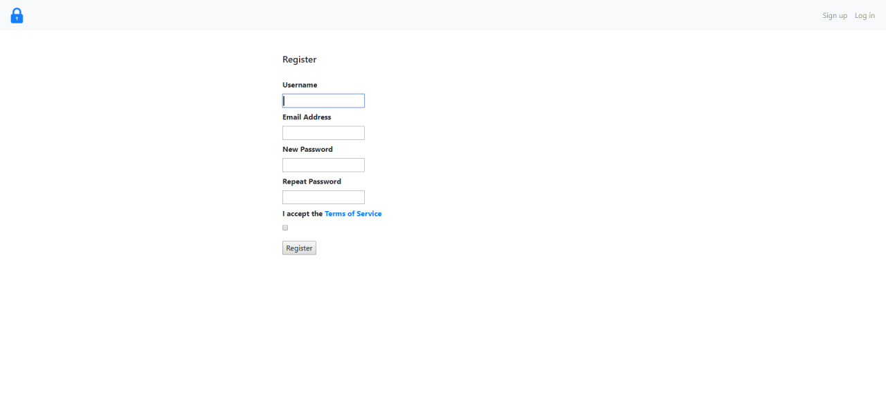

# Smart-Door: CPEN 291 Project
  
A copy of the private repository of the project created by Richard Tian, Sammy Brache, Zhihang Zhang, Amir Tootooni, Robin Reyes, and Johnny Ma
Core files are located in the "Main files" folder

# Main Features:  
  * Lock that is opened and closed using a servo and a pushbutton  
  * Touchscreen interface  
  * NFC key and backup password to unlock the door  
  * Camera to live-stream door entrance and serve as a peephole  
  * App to manage multiple locks, view live-stream and generate and share NFC keys  
  * Server to authenticate keys, manage users and locks and host live-stream  
  * Website to register users, locks and view live-stream remotely  
  
# Images
  
Door  
  
  
  
  
Website login  
  
  
Website live-stream  
  
  
Fritzing diagram
  
  
App  
  
    
    
    
    
    
    